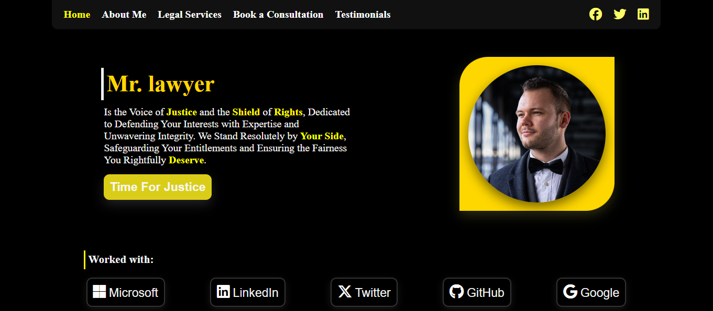

# Mr. Lawyer 🧑‍⚖️💼

A sleek and modern landing page for a law professional. Built with pure **HTML & CSS**, showcasing strong layout skills, font integration, responsive structure, and modern UI/UX.

## 🔧 Features
- Custom `@font-face` integration for EB Garamond.
- Fully responsive and centered layout.
- Hover effects with elegant animations.
- Social media icons via Font Awesome.
- Semantic HTML structure.
- Clean folder organization.

## 🖼️ Preview

## 🌐 Preview
[Live Demo on GitHub Pages](https://moh-alfarjani.github.io/mr-lawyer-landing-page/)

## 🗂️ Structure 
mr-lawyer/ 
&nbsp;&nbsp;├── index.html 
&nbsp;&nbsp;├── README.md 
&nbsp;&nbsp;├── src/ 
&nbsp;&nbsp;&nbsp;&nbsp;&nbsp;&nbsp;├── css/ 
&nbsp;&nbsp;&nbsp;&nbsp;&nbsp;&nbsp;│&nbsp;&nbsp;├── style.css 
&nbsp;&nbsp;&nbsp;&nbsp;&nbsp;&nbsp;│&nbsp;&nbsp;└── all.min.css 
&nbsp;&nbsp;&nbsp;&nbsp;&nbsp;&nbsp;├── js/ 
&nbsp;&nbsp;&nbsp;&nbsp;&nbsp;&nbsp;│&nbsp;&nbsp;└── script.js 
&nbsp;&nbsp;&nbsp;&nbsp;&nbsp;&nbsp;├── img/ 
&nbsp;&nbsp;&nbsp;&nbsp;&nbsp;&nbsp;│&nbsp;&nbsp;├── 1.png 
&nbsp;&nbsp;&nbsp;&nbsp;&nbsp;&nbsp;│&nbsp;&nbsp;└── top.png 
&nbsp;&nbsp;&nbsp;&nbsp;&nbsp;&nbsp;└── fontawesome/ 
&nbsp;&nbsp;&nbsp;&nbsp;&nbsp;&nbsp;&nbsp;&nbsp;&nbsp;&nbsp;├── EBGaramond-Regular.ttf 
&nbsp;&nbsp;&nbsp;&nbsp;&nbsp;&nbsp;&nbsp;&nbsp;&nbsp;&nbsp;├── EBGaramond-Bold.ttf 
&nbsp;&nbsp;&nbsp;&nbsp;&nbsp;&nbsp;&nbsp;&nbsp;&nbsp;&nbsp;└── EBGaramond-SemiBold.ttf 

## 🚀 Tech Used
- HTML5
- CSS3
- Font Awesome (offline)
